# Project 3: Design Journey

Be clear and concise in your writing. Bullets points are encouraged.

**Everything, including images, must be visible in Markdown Preview.** If it's not visible in Markdown Preview, then we won't grade it. We won't give you partial credit either. This is your warning.


## Design Plan

### Project 1 or 2
> Do you plan to reuse your Project 1 or 2 site?
> Which project?

No

> If yes, please include sketches of the site's current design (you may copy the "final" sections from those assignments.)


### Describe your Media Catalog (Milestone 1)
> What will your collection be about?
> What type of media will your site display? (images, videos, audio)

The media collection will be a catalog of nature photos including landscapes and portraits of animals or plants. The tags on the catalog can be for different locations and different species.


### Audiences (Milestone 1)
> Briefly explain your site's audiences. Be specific and justify why each audience is appropriate for your site.
> You are required to have **two** audiences: "information consumers" and "site administrators"

Information Consumer: People who are interested in nature and photography. They are appropriate for the website because they enjoy looking at pictures of wildlife or good photographs in general.

Site Administrator: People who take photographs of nature. They are appropriate for the website because they will want to upload and tag their own photos to the catalog to give their work an audience.


### Personas (Milestone 1)
> Your personas must have a name and a "depiction". This can be a photo of a face or a drawing, etc.
> There is no required format for the persona.
> You may type out the persona below with bullet points or include an image of the persona. Just make sure it's easy to read the persona when previewing markdown.
> Your personas should focus on the goals, obstacles, and factors that influence behavior of each audience.

> Persona for your "consumer" audience:

**Persona's Name: Sarah**


Source: https://www.google.com/url?sa=i&url=https%3A%2F%2Fwww.oregonlive.com%2Fliving%2F2021%2F02%2Fhow-to-find-healing-in-nature-according-to-a-portland-forest-therapist.html&psig=AOvVaw3FPytYeRWLR8HG9oQ7E_vU&ust=1618423380953000&source=images&cd=vfe&ved=0CAIQjRxqFwoTCJjopovn--8CFQAAAAAdAAAAABAD


- 26 years old
- Lives near a forest in California
- Middle school biology teacher

**Factors that influence behavior**

- Enjoys looking at wildlife
- Has seen most of the wildlife in her area
- Has an explorative personalty

**Needs/Desires/Obstacles**

- Wants to see new wildlife
- Wants to find new places to travel
- Wants to show students photos of specific animals
- Does not have her own camera


> Persona for your "administrator" audience:

**Persona's Name: John**

Source: https://cdn.naturettl.com/wp-content/uploads/2017/07/22013347/start-here-lead.jpg

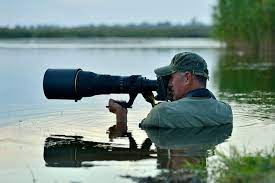
- 52 years old
- Lives in Florida
- Nature photographer

**Factors that influence behavior**
- Recently travelled to Africa
- Has a diverse collection of nature photos
- Has travelled many times in the past

**Needs/Desires/Obstacles**

- Wants to show of his photos
- Wants to show diversity of his collection
- Doesn't use social media
- Wants to inspire other photographers


### Site Design (Milestone 1)
> Document your _entire_ design process. **We want to see iteration!**
> Show us the evolution of your design from your first idea (sketch) to the final design you plan to implement (sketch).
> Show us the process you used to organize content and plan the navigation, if applicable (card sorting).
> Plan your URLs for the site.
> Provide a brief explanation _underneath_ each design artifact. Explain what the artifact is, how it meets the goals of your personas (**refer to your personas by name**).
> Clearly label the final design.

**First Design**

*Content Organization*

I knew right away to separate the two main components of the website into two pages. One page would feature the gallery and the submission form for the gallery, and the other page would be the detail page for each photo in the gallery.

Sorting
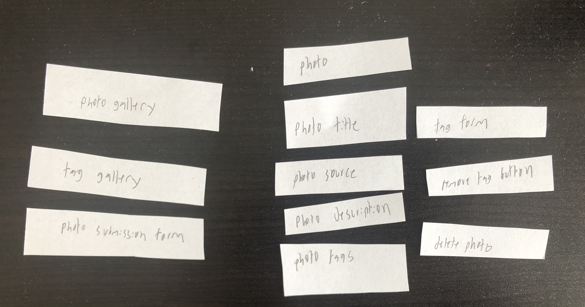

*URL*

Gallery: / or /photos

Detail /photos/photo-title

*Sketch*

Gallery and Submission Form
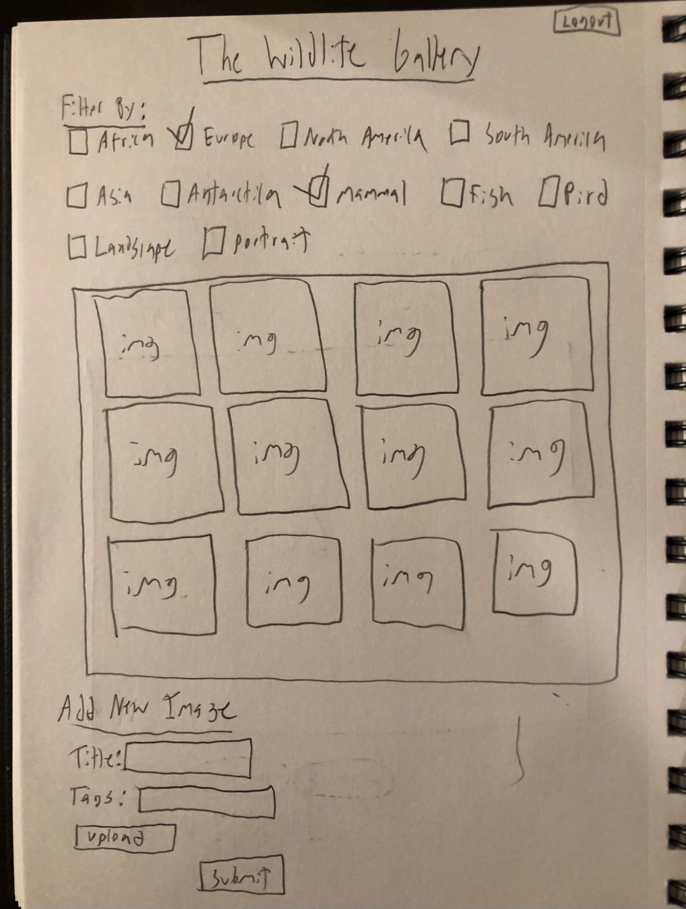
The is the homepage of the website, featuring the catalog, the submission form, and the logout/login button.

Photo Detail
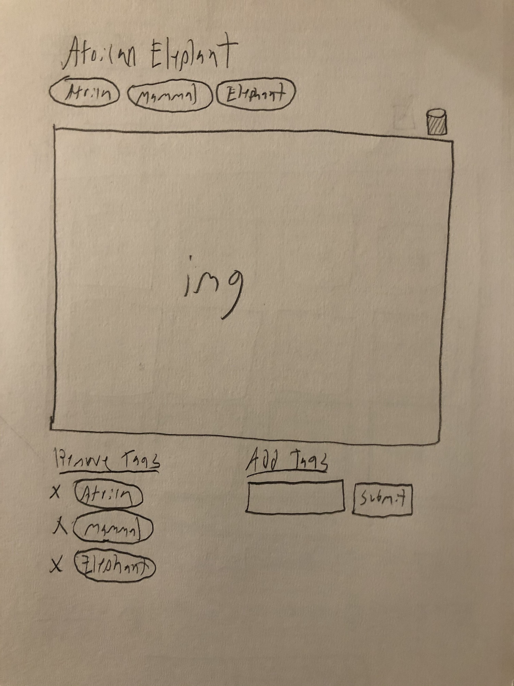
The page appears when the user selects an image. It has a title, tags, the image, a delete button, a form to remove tags, and a form to add tags.

*Design Explanation*

At the top right is a logout button, which will be replaced by the login button if clicked. This button is to help John login, allowing him to submit photos and show them off to any nature fans. This also gives him permission to remove his own photos if he wants to display different work instead. The option to remove tags, add tags, delete photos, and add photos are only available to those who log in.

The gallery has filters at the top so Sarah can find photos from specific animals or places. These filters have locations which can help her figure out where to travel because they reveal which animals are from which locations. The detail page provides more details about each photo including the name and the tags associated with it, helping Sarah learn more about each animal.

**Second Design**

*Content Organization*

The final design has the all the content on one page, making it easier for both Sarah and John to navigate the website by removing the need to travel between pages. No card sorting is needed because I don't want to separate the content into separate pages, I want the content to all be on one main page with popups.

*URL*

Gallery: / or /photos

Photo popup: /photos/title

Login: /login

*Sketch*

Login Pop Up
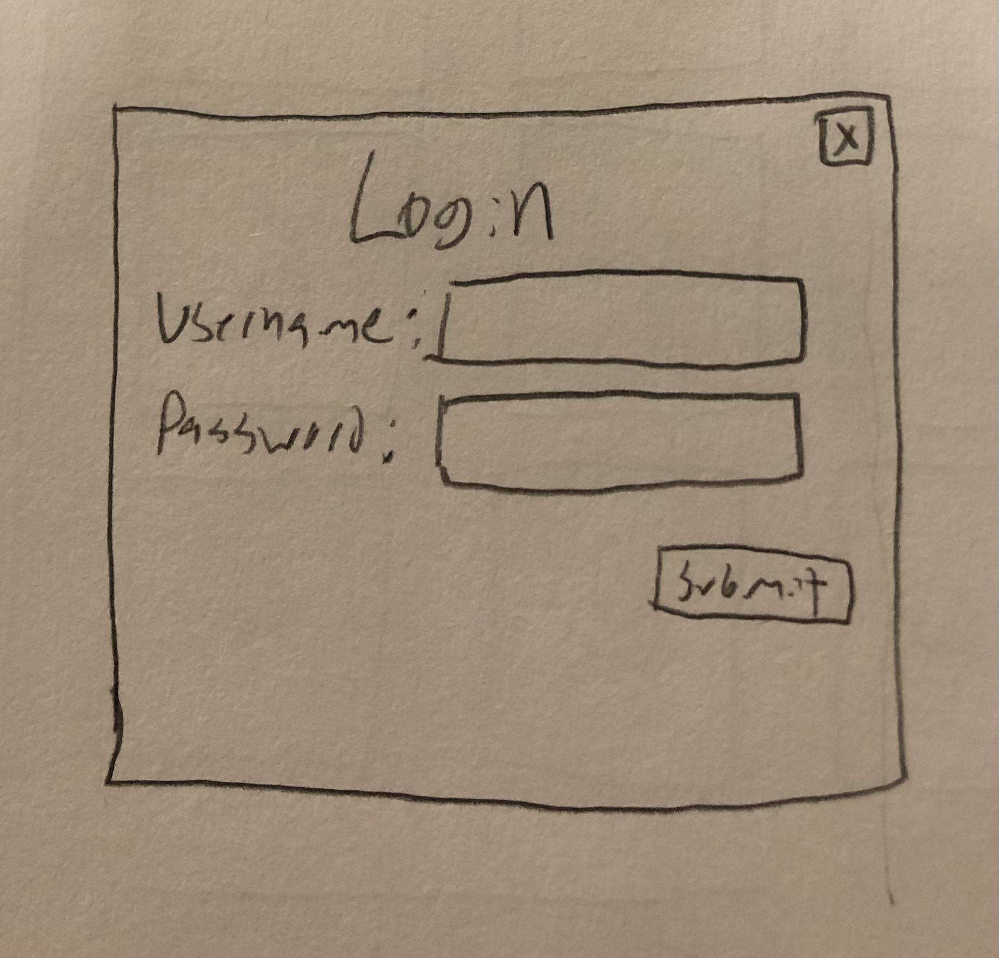
This pop up appears when the user clicks on the login icon on the top right of the gallery.

Gallery
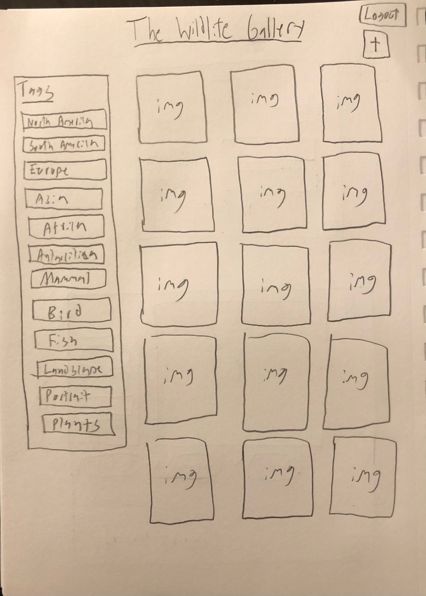
The gallery features a list of tags for filtering, the catalog of images, a logout/login button, and a button for adding a new photo.

New Photo Pop Up
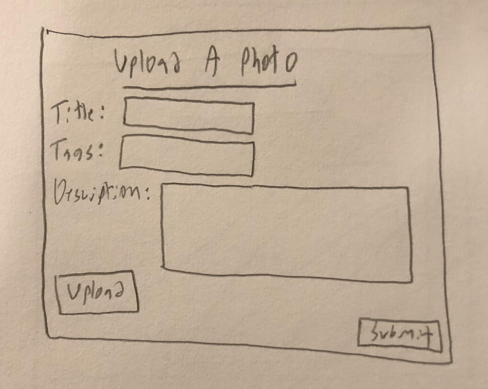
This pop contains a form that allows John to submit a new photo.

Photo Detail Pop Up
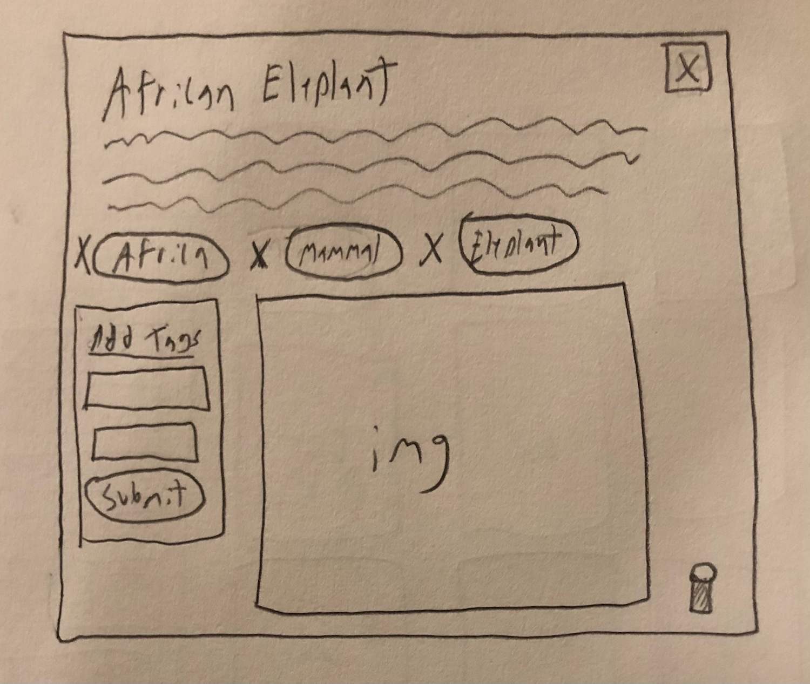
This pop appears when selecting a photo. It displays the photos name, description, tags, the photo, and an editing form and delete button if the user uploaded that photo.

*Explanation*

Pop ups for logging in, uploading a photo, and seeing details about a photo have been implemented to provide Sarah and John ways to utilize every interaction on the website without leaving the page. The filter system has been changed to a tag selecting container to adhere to more conventional catalog designs that Sarah will be more accustomed to. In addition, a description was added to each photo upload to help John explain his work and to help Sarah learn more about each animal, plant, or landscape. The detail page reflects this change and has some minor layout changes made for better spacing.

**Final Design**

*Content organization*

The organization is the same as the second design. There is no navigation menu. This allows Sarah to view all the content she needs by scrolling though the photos gallery or by clicking on a photo, which shows a pop up of the photos details. The popup is a common design pattern that Sarah knows how to use. To leave the popup, she can click the close symbol or anywhere outside the popup. John can also see the details of each photo with the same method. In addition, John can access the features he needs with popups as well. There is a pop up for logging in, changing the tags of his photos, for editing his photos, and for uploading new photos.

*Sketches*

Homepage/gallery

URL: /


Homepage is for users to browse through the photo gallery and filter by selecting tags. Here, Sarah can find images to show to her class or find nature in specific locations. Clicking on a photo in the gallery will reveal the photo's details in a popup. The + logo for uploading photos is only visible to users who are logged in.

Regular photo detail popup

URL: /?photo=x

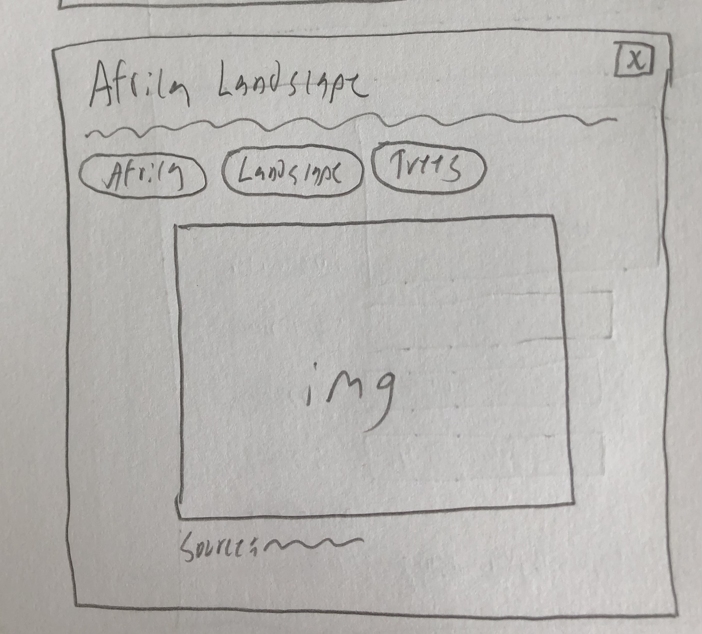
This page allows the viewing audience to see more details about each photo. After clicking a photo in the gallery, they will see a popup with the photo, the title, the description, the source, and the tags.

Photo detail popup for John's photo

URL: /?photo=x

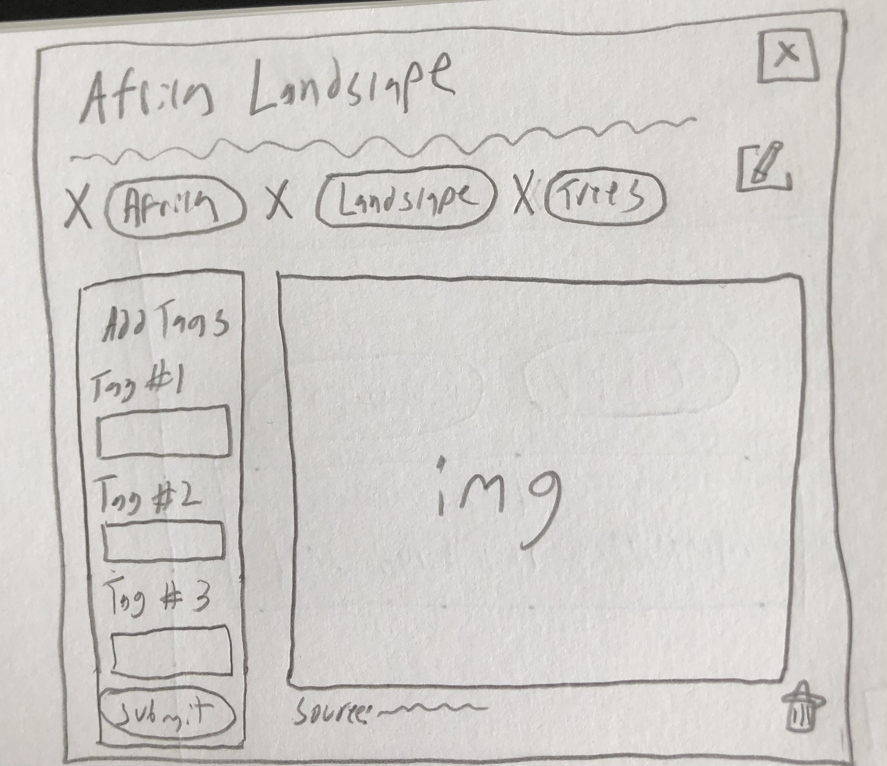
This page allows photographers to view the details of their own photo and make edits. There is a form to add new tags, there is an X next to each tag to delete the tag, there is a button to open the editing popup, and a button to delete the photo. For John to see these buttons and the form, he must be logged in and viewing a photo he uploaded.

Edit photo information popup

URL: /?edit-photo-id=x

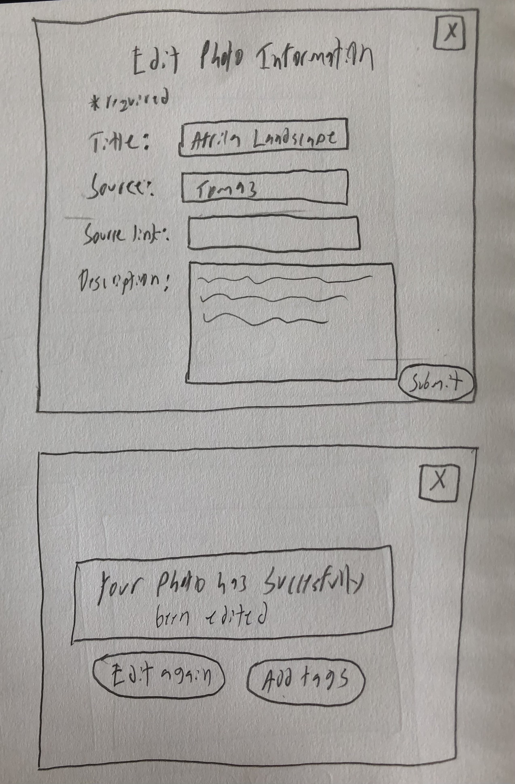
The popup appears if a photographer clicks on the pencil icon on the photo detail page. There is a form to edit the title, source, source link, and description of a photo. The inputs are filled in with the photos current information. After the user submits the edits, there is a confirmation screen with two buttons, one to return to the edit screen and another to see the updated photo detail popup.

Delete confirmation

URL: /?photo=x&delete-photo-id=y

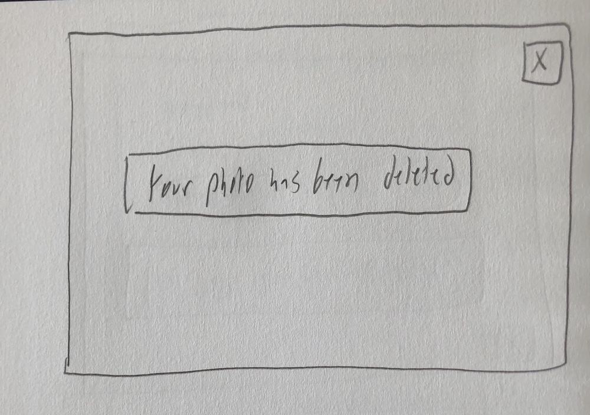
This confirmation will appear after a photographer deletes their own photo.

Upload photo popup

URL: /?window=new-photo

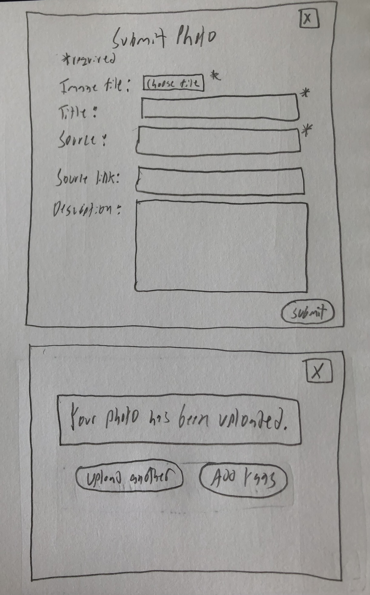
This popup appears after a logged in user clicks the + icon on the homepage. There is a form to upload an image and add its title, source, and description. Once the user submits the form, the confirmation screen appears with a button to return to the upload form or to view the image detail popup to add tags.

*Explanation*

The final design has several key additions and some aesthetic changes. The homepage has the addition of the + icon for uploading and the buttons and tags where rounded. There are many straight lines in the design and the rounded buttons help prevent the theme from looking too rigid, giving Sarah a more pleasant viewing experience. The photo detail page has the addition of the edit button and the following edit popup form, which is necessary for John in case he wants to make changes to his photos. In addition, the edit , the upload, and the delete confirmation pages help John understand if his actions were successful. Both the edit and upload confirmations have navigation buttons that allow John to either view the photo he edited or view the photo he uploaded, creating common navigation flow on catalog sites.


### Design Patterns (Milestone 1)
> Write a one paragraph reflection explaining how you used the design patterns in your site's design.

The catalog uses common design patterns such as having a column on the left that filters the data. The website uses well known symbols like the X and trashcan for closing a popup, deleting an upload, and deleting a tag, as well as using a + sign for adding a new upload. It also follows standard conventions for logging in, with the button located in one of the corners of the website. The URL of /photos also follows a common design patterns, with the plural url indicating a list of items is shown on the page.


## Implementation Plan

### Requests (Milestone 1. Revise in Milestone 2)
> Identify and plan each request you will support in your design.
> List each request that you will need (e.g. view image details, view gallery, edit book, tag product, etc.)
> For each request, specify the request type (GET or POST), how you will initiate the request: (form or query string URL), and the HTTP parameters necessary for the request.

- Request: view all photos
  - Type: GET, query
  - URL: / or /tag-selected = 1
  - Params: none

- Request: view photo details
  - Type: GET, query
  - URL: /?photo=x
  - Params: photos.id

- Request: Upload new photo
  - Type: POST, form
  - URL:  n/a
  - Params: title, source, source link, description, filename, extension, user id

- Request: view photos of X tag
  - Type: GET, query
  - URL: /?tag-seleted=x
  - Params: tags.id

- Request: delete a tag
  - Type: GET, query
  - URL: /?photo=x&delete-tag-id=y
  - Params: photos.id, tags.id

- Request: add a new tag
  - Type: POST, form
  - URL: n/a
  - Params: photos.id, tags.id

- Request: delete a photo
  - Type: GET, query
  - URL: /?photo=x&delete-photo-id=x
  - Params: photos.id

- Request: edit a photo
  - Type: GET, query
  - URL: /?edit-photo-id=x
  - Params: photos.id


### Database Schema (Milestone 1. Revise in Milestone 2)
> Describe the structure of your database. You may use words or a picture. A bulleted list is probably the simplest way to do this. Make sure you include constraints for each field.

> Hint: You probably need a table for "entries", `tags`, `"entry"_tags` (stores relationship between entries and tags), and a `users` tables.

> Hint: For foreign keys, use the singular name of the table + _id. For example: `image_id` and `tag_id` for the `image_tags` (tags for each image) table.

Table: photos
- id: INTEGER {PK, U, NN, AI},
- title: TEXT {NN},
- description: TEXT,
- extension: TEXT {NN},
- citation_link: TEXT,
- citation_text: TEXT {NN},
- user_id: INTEGER {U, NN},
- FOREIGN KEY (user_id) REFERENCES users(id)

Table: tags
- id: INTEGER {PK, U, NN, AI},
- name: TEXT {NN, U}

Table: photos_tags
- id: INTEGER {PK, U, NN, AI},
- photo_id : INTEGER {NN},
- tag_id: INTEGER {NN},
- FOREIGN KEY (photo_id) REFERENCES photos(id),
- FOREIGN KEY (tag_id) REFERENCES tags(id)

Table: users
- id: INTEGER {PK, U, NN, AI},
- name: TEXT, {NN}
- username: TEXT {U, NN},
- password: TEXT {NN}

Table: sessions
-	id: INTEGER {NN, PK, AI, U}
-	user_id INTEGER {NN},
-	session TEXT {NN, U},
- last_login TEXT {NN}
- FOREIGN KEY(user_id) REFERENCES users(id)


### Database Query Plan (Milestone 1. Revise in Milestone 2)
> Plan your database queries. You may use natural language, pseudocode, or SQL.

Select all the photos for display
```
SELECT * FROM photos;
```

Select all tags
```
SELECT * FROM tags
```

 Select photos from certain tag

```
SELECT * FROM photos_tags INNER JOIN photos ON photos_tags.photo_id = photos.id WHERE photos_tags.tag_id = :tag_id;
```

See detail of a photo
```
SELECT * FROM photos WHERE (id = :id);
```

See tags of a photo
```
SELECT tags.id, tags.name FROM tags INNER JOIN photos_tags ON tags.id = photos_tags.tag_id  WHERE (photos_tags.photo_id = :id)
```

Delete a photo
```
DELETE FROM photos WHERE (id = :photo_id)
```

Delete a tag from a photo
```
DELETE FROM photos_tags WHERE (photo_id = :photo_id AND tag_id = :tag_id)
```

Check if a photo has a tag
```
SELECT * FROM photos_tags WHERE (photo_id = :photo_id AND tag_id = :tag_id
```

Add a new tag to a photo
```
INSERT INTO photos_tags (photo_id, tag_id) VAlUES (:photo_id, :tag_id)
```

Add new photo
```
INSERT INTO photos (title, description, user_id, image) VAlUES (:title, :description, :user_id, :image)
```

edit a photo
```
UPDATE photos SET title = :title, description = :description, citation_link = :citation_link, citation_text = :citation_text WHERE id = :edit_id
```

### Code Planning (Milestone 1. Revise in Milestone 2)
> Plan any PHP code you'll need here using pseudocode.
> Use this space to plan out your form validation and assembling the SQL queries, etc.
> Tip: Break this up by pages. It makes it easier to plan.

Gallery
```
if user is an admin
  show add new photo button

initialize photos array pull all photos from db

if GET(login or logout)
  show login/logout popup

if GET(photo id)
    show photo detail popup

if GET(tag names)
  retrieve tags from url
  query photos with new tag and change photos array

for each record in record
    display image with image path in record

```

Detail Page
```

select photo from db
select tags for that photo from db

if user is authorized to edit
    if GET(tag id for delete)
        remove photos_tags from db
        update tags array
        show confirmation

    if GET(photo id for edit)
        render edit photo popup

    if POST(submit tags)
        if form is valid
            if tag already exists
                if photos_tags does not exist
                    create new photos_tags
            else if tag does not exist
                create new tag
                create new photos_tags
                update tags array
        else
          show feedback
          set sticky values

render photo title, description, source, image
render tags and delete buttons
```

New photo form
```
if user submits new photo
  if form is valid
      add new photo to photos table
      show confirmation
  else
    show form feedback
```

Edit photo form
```
if user submits form
    if form is valid
        update record in db
        show confirmation
    else
      show form feedback
```

## Submission

### Audience (Final Submission)
> Tell us how your final site meets the needs of the audiences. Be specific here. Tell us how you tailored your design, content, etc. to make your website usable for your personas. Refer to the personas by name.

The site meets Sarahs needs by providing a gallery of nature images that she can use for travel inspiration or to show in her class. Sarah can find photos from specific places or of specific types of species using the tag filters. In addition, Sarah can click on any image to see more details to further satisfy her curiosity and learn about each photo. The site meets Johns needs by providing him means to upload his photography and showcase it to any interested viewers. John can take advantage of the tags feature to categorize his photos, allowing the viewing audience that is particularly interested in his work to find it easily. John can also edit photos and delete photos, allowing him to specifically tailor his photography showcase in any ways he sees fit.


### Additional Design Justifications (Final Submission)
> If you feel like you haven’t fully explained your design choices in the final submission, or you want to explain some functions in your site (e.g., if you feel like you make a special design choice which might not meet the final requirement), you can use the additional design justifications to justify your design choices. Remember, this is place for you to justify your design choices which you haven’t covered in the design journey. You don’t need to fill out this section if you think all design choices have been well explained in the design journey.

Overall, the website's design uses simple colors like black and white and sparingly uses green and red for feedback messages. While one may not think this matches the theme of nature, the simple colors help the colors of the photos stand out. The colors of the photos are more important than the text or the background so I want people like Sarah to be drawn to the photo colors. In addition, having too many colors on the website in combination with the variety of colors on the photos would not be aesthetically pleasing.


### Self-Reflection (Final Submission)
> Reflect on what you learned during this assignment. How have you improved from Project 1? What things did you have trouble with?

In this assignment, I learned how to use PHP to create a dynamic website that supports posts, gets, updates, and deletes. I also figured out good ways to handle site navigation beyond the traditional method of using a navigation bar. In addition, I was able to sharpen by SQL skills and get good practice using join statements. I had very good understanding of all the technical concepts. What gave me the most trouble was small syntax mistakes that took a while to find.


### Grading: Mobile or Desktop (Final Submission)
> When we grade your final site, should we grade this with a mobile screen size or a desktop screen size?

Desktop


### Grading: Step-by-Step Instructions (Final Submission)
> Write step-by-step instructions for the graders.
> The project if very hard to grade if we don't understand how your site works.
> For example, you must login before you can delete.
> For each set of instructions, assume the grader is starting from /

Viewing all entries:
1. go to the homepage (URL: /)

View all entries for a tag:
1. click on a tag on the side of the homepage

View a single entry and all the tags for that entry:
1. click on an image in the homepage

How to insert and upload a new entry:
1. login and click on the + sign on the homepage
2. fill out the form and press submit

How to delete an entry:
1. login and click on an image you have uploaded in the homepage
2. click on the trash icon on the popup

How to view all tags at once:
1. all tags are visible in the homepage

How to add a tag to an existing entry:
1. login and click on an image you have uploaded
2. fill out the add tags form and press submit

How to remove a tag from an existing entry:
1. login and click on an image you have uploaded
2. click on the X left of the tag you want to delete

How to edit an entry:
1. login and click on an image you have uploaded
2. click on the pencil icon
3. fill out form and press submit
